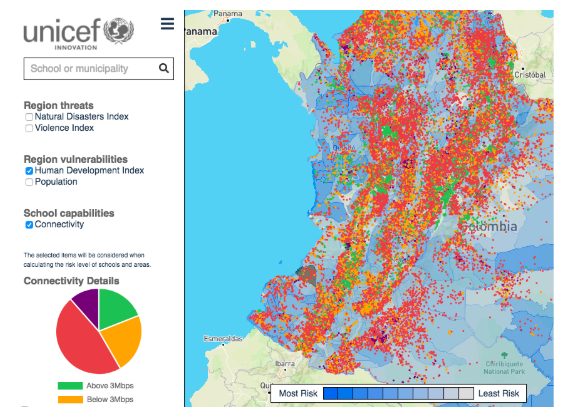

# Magic Box Maps 2.0

## Developing
To get started:
1. Fork the project to your GitHub account and clone it.
2. Copy `.env.local.sample` to `.env.local`.
  - The school data included in this file is a small, "fake" data set for development use. To use the full data set, change the `REACT_APP_SCHOOLS_URL` variable in .env.
3. Run `npm install; npm start`.
4. Create feature branch. When done create pull request to development branch of this repository.

For more information on getting started, see the  [create-react-app guide](https://github.com/facebookincubator/create-react-app/blob/master/packages/react-scripts/template/README.md).

## Git Workflow

We are using the `development` branch as the main development branch for work on Magic Box Maps 2.0. Our development environment is deployed from this branch. Feature branches can be branched from `development` and merged back up when ready.

## Data

The `public/data/schools.json` file includes a small set of "fake" data. The [full data set](https://github.com/unicef/magicbox-data/blob/master/data/schools.json) is available in the private magicbox-data repo.

## Docker

In the root of this project directory is a Dockerfile which can be built to deploy to a container platform (or testing locally). To build the image run the following command:

`docker build -t unicef/magicbox-map .`

With this image you can run it locally by running:
`docker run -p 80:8080 unicef/magicbox-map`

### Building on a container platform

When building on a container platform, be sure to set the environment variables before building. You can set the environment variables in the build container, or you can pass the variables to the docker build command:

```
docker build -t unicef/magicbox-map . \
--build-arg REACT_APP_SCHOOLS_URL=/data/schools.json \
--build-arg REACT_APP_SHAPES_URL=/data/mpio-hdi-pop-threats-violence.json
```

When adding a new environment variable, remember to include it in:
- The JavaScript file where it's actually used (probably `api-config.js`)
- The Dockerfile
- This readme

To find out which environment variables are in use, see `.env.local.sample`.
